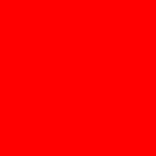

# Day 43 - Introduction to CSS: Making the Web Beautiful

For the past two days, you've been building HTML documents that look... plain. That's because HTML is only about structure and content—it's CSS (Cascading Style Sheets) that makes websites beautiful. CSS is a styling language that controls colors, fonts, layouts, spacing, and virtually every visual aspect of a webpage.

Today you'll learn the fundamentals: how to connect CSS to HTML, how selectors work, and how to style elements with colors, fonts, and sizes.

## What is CSS?

CSS stands for Cascading Style Sheets. It was created to solve a problem: early websites had HTML doing double duty—structuring content AND trying to look good. The result was messy, inconsistent, and hard to maintain.

CSS separates concerns: HTML handles what content exists, CSS handles how it looks. This separation is fundamental to modern web development.

Think of it like a house: HTML is the blueprint (structure, walls, rooms), and CSS is the interior design (paint, furniture, decorations). You can change the interior design without touching the blueprint.

## Three Ways to Add CSS

CSS can be added to HTML in three ways, each with different use cases:

### 1. Inline Styles

Apply styles directly to a single element:

```html
<p style="color: blue; font-size: 20px;">This text is blue and large.</p>
```

Quick and dirty—useful for quick testing, but bad for maintainability. If you want to change the color, you'd have to find and change every single element.

### 2. Internal CSS

Add a `<style>` block in the `<head>` of your document:

```html
<!DOCTYPE html>
<html>
<head>
    <title>My Page</title>
    <style>
        p {
            color: blue;
            font-size: 20px;
        }
    </style>
</head>
<body>
    <p>This paragraph is styled.</p>
</body>
</html>
```

Better than inline—styles are centralized in one place. Good for single-page projects.

### 3. External CSS (Recommended)

Create a separate `.css` file and link to it:

```html
<!-- In index.html -->
<!DOCTYPE html>
<html>
<head>
    <title>My Page</title>
    <link rel="stylesheet" href="style.css">
</head>
<body>
    <p>This paragraph is styled.</p>
</body>
</html>
```

```css
/* In style.css */
p {
    color: blue;
    font-size: 20px;
}
```

This is the professional approach. One CSS file can style every page on your website. Change it once, update everywhere.

## CSS Selectors: Targeting Elements

CSS works by selecting HTML elements and applying styles to them. There are several ways to select:

### Element Selector

Style all elements of a type:

```css
p {
    color: blue;
}
```

Every paragraph on the page will be blue.

### Class Selector

Style elements with a specific class (prefix with `.`):

```css
.color-title {
    font-weight: normal;
}
```

The HTML:
```html
<h2 class="color-title">Rojo</h2>
```

Classes can be reused on multiple elements.

### ID Selector

Style one unique element (prefix with `#`):

```css
#red {
    color: red;
}
```

The HTML:
```html
<h2 id="red">Rojo</h2>

IDs should be unique—one element per page.

### Universal Selector

Style everything:

```css
* {
    color: red;
}
```

Useful for resetting default styles, but use sparingly.

## The Color Vocab Project

Let's see these selectors in action. The color vocabulary website teaches Spanish color words:

```html
<!-- index_color_vocab_website.html -->
<h2 class="color-title" id="red">Rojo</h2>


<h2 class="color-title" id="blue">Azul</h2>


<h2 class="color-title" id="orange">Anaranjado</h2>
<h2 class="color-title" id="green">Verde</h2>
<h2 class="color-title" id="yellow">Amarillo</h2>
```

The CSS applies colors using ID selectors:

```css
/* style.css */
.color-title {
    font-weight: normal;
}

img {
    width: 200px;
    height: 200px;
}

#red {
    color: red
}

#blue {
    color: blue;
}

#orange {
    color: orange;
}

#green {
    color: green;
}

#yellow {
    color: yellow;
}
```

This is a perfect example of when to use IDs vs classes:
- Classes (`.color-title`): Shared by multiple elements—they all need the same font weight
- IDs (`#red`, `#blue`): Unique to each element—each needs its own color

## Color Values in CSS

Colors can be specified in multiple ways:

### Named Colors

```css
p {
    color: red;
    background-color: coral;
}
```

There are 140+ named colors in CSS (red, blue, green, coral, navy, etc.). Easy to read, but limited.

### RGB Values

```css
p {
    color: rgb(255, 0, 0);  /* Pure red */
    color: rgb(0, 0, 0);    /* Black */
    color: rgb(255, 255, 255); /* White */
}
```

RGB mixes red, green, and blue (0-255 each). `rgb(255, 0, 0)` is maximum red, no green, no blue.

### Hexadecimal

```css
p {
    color: #ff0000;  /* Red */
    color: #000000;  /* Black */
    color: #ffffff;  /* White */
}
```

Hex codes are just RGB in hexadecimal (base-16). `#ff` = 255, `#00` = 0. This is the most common format in professional CSS.

## Sizing: Pixels and More

```css
img {
    width: 200px;
    height: 200px;
}
```

Pixels (`px`) are fixed units—they're exactly that many screen pixels. Other units include:

- `em` — Relative to parent font size (1em = parent's font size)
- `rem` — Relative to root font size
- `%` — Percentage of parent
- `vh` / `vw` — Percentage of viewport height/width

## Font Properties

```css
p {
    font-family: Arial, sans-serif;
    font-size: 16px;
    font-weight: bold;
    font-style: italic;
}
```

- `font-family`: Which font to use (fallback fonts separated by commas)
- `font-size`: How big
- `font-weight`: bold, normal, or numeric (100-900)
- `font-style`: italic or normal

## The Cascade (Cascading)

The "C" in CSS stands for cascading—a fundamental concept. When multiple rules target the same element, CSS has a priority system:

1. **Inline styles** (highest priority)
2. **ID selectors** 
3. **Class selectors**
4. **Element selectors** (lowest priority)

But specificity matters more than order. A class beats an element selector, even if the element comes later in your CSS.

```css
/* This will lose to a class selector */
p {
    color: blue;
}

/* This wins */
.highlight {
    color: red;
}
```

## Try It Yourself

Open the color vocab website and see the CSS in action:

```bash
open "index_color_vocab_website.html"
```

Then experiment:
1. Change the colors (try hex codes like `#FF5733`)
2. Change the image sizes (try 150px or 300px)
3. Add a new color (create a new heading and matching CSS)

## Viewing CSS in Your Browser

Every browser has developer tools:
- **Chrome/Edge**: Right-click → Inspect
- **Firefox**: Right-click → Inspect Element
- **Safari**: Develop → Show Web Inspector

The Elements panel shows your HTML, and clicking any element shows its CSS on the right. You can even toggle styles on/off and change values to experiment.

## Moving Forward

Today you learned CSS fundamentals: selectors, colors, sizing, and how to connect CSS to HTML. These skills apply to every website you'll build.

Tomorrow we'll go deeper into the box model, typography, and positioning—making layouts that rival professional websites.
