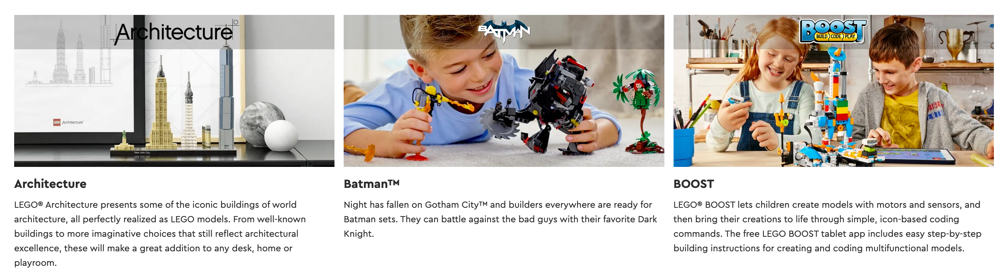

# Learn to Aggregate and Merge Data in Pandas while Analyzing a Dataset of LEGO Pieces

Today we're going to be diving deep into a dataset all about LEGO, which will help us answer a whole bunch of interesting questions about the history of the company, their product offering, and which LEGO set rules them all:

What is the most enormous LEGO set ever created and how many parts did it have?

In which year were the first LEGO sets released and how many sets did the company sell when it first launched?

Which LEGO theme has the most sets? Is it Harry Potter, Ninjago, Friends or something else?

When did the LEGO company really take-off based on its product offering? How many themes and sets did it release every year?

Did LEGO sets grow in size and complexity over time? Do older LEGO sets tend to have more or fewer parts than newer sets?


## Use HTML Markdown to Make Your Notebook Look Pretty

The cells inside the notebook can either be code cells for your Python code or Text (Markdown) cells. 
The starter notebook includes a few of these Text cells with section headings and challenge text. 
However, we can style these cells even more by using HTML (see Days 43 and 44).

## Insert a Markdown Cell

Add a new Text cell below the Introduction.

## Adding Images

Display an image in a Text cell, use an HTML `` tag with the URL of the image. For example:

    

If you are using Jupyter Notebook instead of Google Colab, you can also link to one of the files provided in the .zip like so:

    

## Section Headings

You can add section headings using tags like `<h1>` or `<h2>`. However, the Notebook also has its own shorthand for common HTML tags. 
For example, you can use the `#` symbol as a shortcut. 
Here's how the headings change their size up to a minimum of `<h5>`:


# 1. Exploring the LEGO Brick Colours

## Import Pandas

As always, the first step is importing the module that we'll use: Pandas

    import pandas as pd

## Examine the Structure

From there we can read the .csv file and take a look at the first 5 rows.

    colors = pd.read_csv('data/colors.csv')
    colors.head()

We see that there are 5 columns, which include the name of the colour and its corresponding RGB value. 
To find the number of unique colours, all we need to do is check if every entry in the name column is unique: 

    colors['name'].nunique()
    267

This shows us that there are 267 unique colours for LEGO blocks.

## Find the number of transparent colours

One way you can do this is through combining our old friend, the `.groupby()` method, with the `.count()` method.

    colors.groupby('is_trans').count()

Here we just group by the `is_trans` column and count the entries.

But you might have also come across the very handy `.value_counts()` method in your research.

    colors.is_trans.value_counts()

Once again, we select the column (here with the `.`dot notation) and call the method. 
The `.value_counts()` method is a very quick way of finding the number of members of each category.

    id  name  rgb   is_trans                
    222   222  222      f
    45    45   45       a

    is_trans
    f    222
    t     45
    Name: count, dtype: int64


# 2. Find the Oldest and Largest LEGO Sets


## Markdown Challenge Solution

Here's how you'd organize the markdown cells with the section headings and image tags. 
You might have also spotted that enclosing text in the double-asterisk `**` symbol will make it **bold**.

Walk into a LEGO store and you will see their products organized by theme. Their themes include Star Wars, Batman, Harry Potter and many more.

### **Challenge**: Display this image: https://i.imgur.com/aKcwkSx.png

    

## Exploring the sets.csv

The **sets.csv** contains a list of LEGO sets. It shows in which year the set was released and the number of parts in the set.
Can you take the first steps in exploring this dataset? Read the .csv and take a look at the columns.

## Then try and answer the following questions:
- In which year were the first LEGO sets released and what were these sets called?
- How many different products did the LEGO company sell in their first year of operation?
- What are the top 5 LEGO sets with the most number of parts? 

## Solution

The first step as always is reading the .csv file and looking what's in it. We see that there's some sort of id for each set (the `set_num`), the name of the set, the year in which it was released, the `theme_id` (the code for the theme name) and the number of parts.

So it looks like we have everything we here to answer our two questions.

## To find the year when the first LEGO sets were released we have to sort by the year column. 
The `.sort_values()` method will by default sort in ascending order.

    sets.sort_values('year').head()


Looks like LEGO started all the way back in 1949! 😮 The names for these sets are nothing to write home about, but let's find out how many different products the company was selling in their first year since launch:

### **Challenge**: 
How many different sets did LEGO sell in their first year? How many types of LEGO products were on offer in the year the company started?

    sets[sets.year == 1949]

Back in 1949, LEGO got started selling only 5 different sets! Note that here we are filtering our DataFrame on a condition. 
We are retrieving the rows where the year column has the value 1949: `sets['year'] == 1949`.

Now let's find the LEGO set with the largest number of parts. If we want to find the largest number of parts, then we have to set the `ascending` argument to `False` when we sort by the `num_parts` column.


# 3. Visualise the Number of Sets Published over Time

Now let's take a look at how many sets the LEGO company has published year-on-year. 
This might tell us something about how LEGO's product offering has changed over time.

First, let's import `Matplotlib` so we can visualise our findings up top:

## Challenge
Now, let's create a new Series called `sets_by_year` which has the years as the `index` and the number of sets as the `value`. 
The result should look something like this:
The trick is grouping the data by the year and counting the number of entries for that year.

    sets_by_year = sets.groupby('year').count()
    sets_by_year['set_num'].head()
    
    year
    1949     5
    1950     6
    1953     4
    1954    14
    1955    39
    Name: set_num, dtype: int64

    sets_by_year['set_num'].tail()
    
    year
    2021    1221
    2022    1203
    2023    1131
    2024    1034
    2025      22
    Name: set_num, dtype: int64

From this, we can see that LEGO published less than 10 different sets per year during its first few years of operation. 
But by 2023 the company had grown spectacularly, releasing 1131 sets in that year alone!

You also notice that there is an entry for 2025. The .csv file is from late 2024, so it appears that it already includes some sets on a forward-looking basis. 
We'll have to take this into account for our charts:

    plt.plot(sets_by_year.index, sets_by_year.set_num)

If we don't exclude the last two years we get a dramatic drop at the end of the chart. 
This is quite misleading as it suggests LEGO is in big trouble! Given the dataset does not include a full calendar year for 2025, it's best to exclude the last two rows to get a better picture:

    plt.plot(sets_by_year.index[:-2], sets_by_year.set_num[:-2])

The Python List **slicing** syntax covered in Day 21 comes in quite handy here!

We also see that while the first 45 years or so, LEGO had some steady growth in its product offering, but it was really in the mid-1990s that the number of sets produced by the company increased dramatically! We also see a brief decline in the early 2000s and a strong recovery around 2005 in the chart.


# 4. How to use the Pandas `.agg()` function

Often you find yourself needing to summarize data. This is where the `.groupby()` function comes in really handy. 
However, sometimes you want to run even more operations based on a particular DataFrame column. This is where the `.agg()` method comes in.

In our case, we want to calculate the number of different themes by calendar year. 
This means we have to group the data by year and then count the number of unique `theme_id`s for that year.

## Number of Themes per Calendar Year

We can accomplish this by chaining the `.groupby()` and the `.agg()` functions together:


### Aggregate Data with the Python .agg Function 

Let's work out the number of different themes shipped by year. This means we have to count the number of unique theme ids per calendar year.

    themes_by_year = sets.groupby('year').agg({f'theme_id': pd.Series.nunique})

Note, the `.agg()` method takes a **dictionary** as an argument. In this dictionary, we specify which operation we'd like to apply to each column. 
In our case, we just want to calculate the number of unique entries in the `theme_id` column by using our old friend, the `.nunique()` method.

Let's give our column in `themes_by_year` a more appropriate name and let's take a look at what we've got:
```
themes_by_year.rename(columns = {'theme_id': 'n_themes'}, inplace = True)
themes_by_year.head()
themes_by_year.tail()
```

Here we can see that LEGO only had 2 themes during the first few years, but just like the number of sets the number of themes expanded manifold over the years. 
Let's plot this on a chart again.

    plt.plot(themes_by_year.index[:-2], themes_by_year.n_themes[:-2])

Again, we're using the same **slicing** technique as before. In the chart, we can see that LEGO has pretty consistently added more and more themes until the mid-1990s. 
From then the number of themes has stagnated for around 10 years or so until the early 2010s.


# 5. Superimposing Line Charts with Separate Axes

Wouldn't it be nice to have the number of themes and the number sets on the same chart? 
But what do we get if we just plot both of them the way we have before? 
```
plt.plot(themes_by_year.index[:-2], themes_by_year.nr_themes[:-2])
plt.plot(sets_by_year.index[:-2], sets_by_year.set_num[:-2])
```

Well, that's not very informative! 🤦‍♀️ The problem is that the "number of themes" and the "number of sets" have very different scales. 
The theme number ranges between 0 and 100, while the number of sets ranges between 0 and 1200. So what can we do?

## Two Separate Axes

We need to be able to configure and plot our data on two separate axes on the same chart. 
This involves getting hold of an axis object from **Matplotlib**.

    ax1 = plt.gca() # get current axes
    ax2 = ax1.twinx()

We then create another axis object: `ax2`. The key thing is that by using the `.twinx()` method allows `ax1` and `ax2` to share the same **x-axis**. 
When we plot our data on the axes objects we get this:

    ax1.plot(sets_by_year.index[:-2], sets_by_year.set_num[:-2])
    ax2.plot(themes_by_year.index[:-2], themes_by_year.nr_themes[:-2])

That's very nice! But there's one problem: we can't tell the lines apart because they have the same colour! 
Let's add some styling. Let's:
- colour in the lines
- colour in the axes and
- add some labels

so that we can see what's going on. Here's what we get:

    ax1 = plt.gca() # get current axes
    ax2 = ax1.twinx() # #Create another axis that shares the same x-axis

    ax1.plot(sets_by_year.index[:-2], sets_by_year.set_num[:-2], color='g')
    ax2.plot(themes_by_year.index[:-2], themes_by_year.nr_themes[:-2], color='b')

    ax1.set_xlabel('Year') 
    ax1.set_ylabel('Number of Sets', color='green')
    ax2.set_ylabel('Number of Themes', color='blue')


# 6. Scatter Plots: Average Number of Parts per LEGO Set

## Complexity Over Time

Have LEGO sets become larger and more complex over time? Let's work out the average number of parts per LEGO set. 
This is the perfect time to revise how to use the `.agg()` function.

Once again, we're going to use the `.groupby()` and the `.agg()` function together to work this one out. 
However, this time we pass a dictionary to the `.agg()` function so that we will target the `num_parts` column with the `mean()` function. 
That way, we group our data by year and then we average the number of parts for that year.

    parts_per_set = sets.groupby('year').agg({f'num_parts': pd.Series.mean})
    parts_per_set.head()

To visualize our `parts_per_set` data, let's create a **scatter plot**. A scatter plot simply uses dots to represent the values of each data point.

We just need to call the `.scatter()` instead of the `.plot()` method to create the chart. 

For the x-values, we'll use the `index` of the `parts_per_set` Series (the years) and for the y-values, we'll use the `values` of the series (the column name happens to be `num_parts`).

From the chart, we can definitely make out an upward trend in the size and complexity of the LEGO sets based on the average number of parts. 
In the 2010s the average set contained around 200 individual pieces, which is roughly double what average LEGO set used to contain in the 1960s.


# 7. Relational Database Schemas: Primary and Foreign Keys

LEGO has licensed many hit franchises from **Harry Potter** to **Marvel Super Heroes** to many others. But which theme has the largest number of individual sets? 
Is it one of LEGO's own themes like **Ninjago** or **Technic** or is it a third party theme? 
Let's analyse LEGO's product lines in more detail!


## Number of Sets per LEGO Theme

To count the number of sets per Theme we can use the `.value_counts()` method on our theme_id column. But there's one problem:

    set_theme_count = sets["theme_id"].value_counts()
    set_theme_count[:5]

    theme_id
    501    1172
    158     939
    503     755
    494     597
    435     545
    Name: count, dtype: int64

We have no idea what our themes are actually called! 🤨 
Ok, we can see that the theme with id **158** is the largest theme containing **753** individual sets, but what's that theme called? 
This is not very helpful. We need to find the names of the themes based on the ``theme_id`` from the **themes.csv** file.

## Working with a Relational Database

What is a database schema? A **schema** is just how the database is organized. Many relational databases, such as our LEGO data, is split into individual **tables**. 
We have separate **tables** for the **colors**, the **sets** and the **themes**. 
With a relational database, the tables are linked to each other through their keys.

## Understand the theme.csv file

The **themes.csv** file has the actual theme names. How is this table linked to the others tables? Well, the **sets.csv** has `theme_ids` which match the `id` column in the **themes.csv**.

This means that the `theme_id` is the `foreign key` inside the **sets.csv**. Many different sets can be part of the same theme. But inside the **themes.csv**, each `theme_id`, which is just called `id` is unique. This uniqueness makes the `id` column the `primary key` inside the **themes.csv**. To see this in action, explore the **themes.csv**.

The theme names are not unique. If we search for the name "Star Wars", we see that 4 different `ids` correspond to that name.

    themes[themes.name == 'Star Wars']

Why would Star Wars have so many different themes? We can check which products corresponded to those themes in the sets.csv:

    sets[sets.theme_id == 18]

**Star Wars** is a really long-running franchise. Theme number 18 was running from 2000 to 2002 and seems to be comprised of several of the show's characters. 
What about, say theme 209?
Here we see that all of the **Star Wars Advent Calendars** share the same `theme_id`. That makes sense.


## How to Merge DataFrames and Create Bar Charts

Wouldn't it be nice if we could combine our data on theme names with the number sets per theme? 
Let's use the `.merge()` method to combine two separate DataFrames into one. The merge method works on columns with the same name in both **DataFrames**.
Currently, our `theme_ids` and our number of sets per theme live inside a Series called `set_theme_count`.

    set_theme_count = sets["theme_id"].value_counts()
    set_theme_count[:5]

To make sure we have a column with the name `id`, I'll convert this Pandas **Series** into a Pandas **DataFrame**.

##  Merging (i.e., Combining) DataFrames based on a Key

    set_theme_count = pd.DataFrame({'id': set_theme_count.index, 'set_count': set_theme_count.values})
    set_theme_count.head()

Here I'm providing a **dictionary** to create the **DataFrame**. The `keys` in the dictionary become my column names.

## The Pandas `.merge()` function

To `.merge()` two DataFrame along a particular column, we need to provide our two DataFrames and then the column name on which to merge. 
This is why we set `on='id'`. Both our `set_theme_count` and our `themes` DataFrames have a column with this name.

    merged_df = pd.merge(set_theme_count, themes, on='id')
    merged_df.head()

Aha! **Star Wars** is indeed the theme with the most LEGO sets. Let's plot the top 10 themes on a chart.
**#not in 2024 it's not**


## Creating a Bar Chart

**Matplotlib** can create almost any chart imaginable with very few lines of code. Using `.bar()` we can provide our theme names and the number of sets. 
This is what we get:

    plt.bar(merged_df.name[:10], merged_df.set_count[ :10])

That worked, but it's almost unreadable. 😩 The good thing for us is that we already know how to customize our charts! 
Here's what we get when we increase the size of our `figure`, add some `labels`, and most importantly, `rotate` the category names on the x-axis so that they don't overlap.
```
plt.figure(figsize=(14,8))
plt.xticks(fontsize=14, rotation=45)
plt.yticks(fontsize=14)
plt.ylabel('Nr of Sets', fontsize=14)
plt.xlabel('Theme Name', fontsize=14)
 
plt.bar(merged_df.name[:10], merged_df.set_count[:10])
```


# 8. Learning Points & Summary

In this lesson we looked at how to:
- use `HTML Markdown` in `Notebooks`, such as section headings `#` and how to embed images with the `` tag.
- combine the `groupby()` and `count()` functions to aggregate data
- use the `.value_counts()` function
- slice **DataFrames** using the square bracket notation e.g., `df[:-2] or df[:10]`
- use the `.agg()` function to run an operation on a particular column
- `rename()` columns of **DataFrames**
- create a line chart with two separate axes to visualize data that have different scales.
- create a `scatter` plot in **Matplotlib**
- work with tables in a relational database by using **primary** and **foreign keys**
- `.merge()` DataFrames along a particular column
- create a `bar` chart with **Matplotlib**

